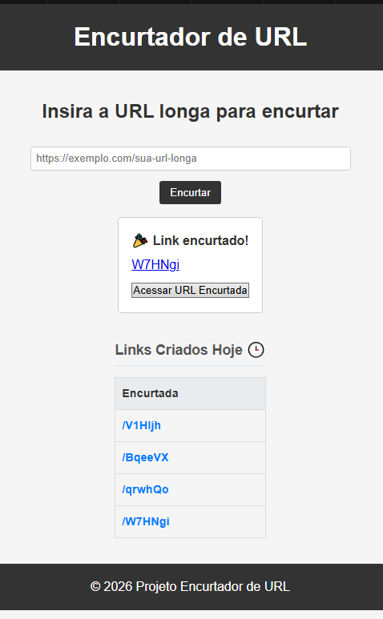
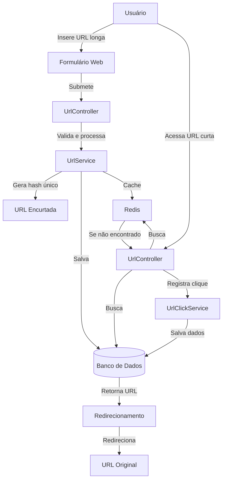

# Encurtador de URL

Este projeto é um serviço de encurtamento de URLs usando Spring Boot e Redis. O objetivo é aplicar conceitos básicos de criação de uma aplicação web, persistência, cache e rastreamento de acessos.

## Como o sistema funciona

1. O usuário informa uma URL longa no formulário web.
2. O servidor gera um identificador curto (hash) para essa URL.
3. A URL longa é salva no banco de dados.
4. Uma cópia em cache é armazenada no Redis para consultas mais rápidas.
5. Quando alguém acessa a URL curta, o sistema busca a URL original e redireciona o usuário.
6. Cada clique é registrado para analisar o uso e origem do acesso.

## Conceitos importantes

- Encurtamento: transformar uma URL longa em um caminho curto e único.
- Persistência: armazenar dados em banco de dados para não perder informações.
- Cache: usar Redis para armazenar resultados e melhorar desempenho.
- Redirecionamento: enviar o usuário para a URL original ao acessar a versão curta.
- Registro de cliques: acompanhar quem acessou a URL e algumas informações do visitante.

## Fluxo de dados

## Tecnologias utilizadas

- Java 17+
- Spring Boot
- Spring Data JPA
- Redis
- Thymeleaf
- Maven

## Destaques do projeto

- Geração de identificadores curtos únicos e previsíveis.
- Integração com Redis para cache de URLs e alta performance.
- Registro detalhado de cliques com dados de referenciador, país e user-agent.
- Persistência confiável com Spring Data JPA e suporte a múltiplos bancos.
- Interface simples em Thymeleaf para criação e visualização de histórico diário.
- Arquitetura modular com serviços separados (UrlService, UrlClickService) facilitando testes e manutenção.
- Tratamento de duplicidade: evita salvar a mesma URL mais de uma vez.
- Fácil configuração via application.properties e empacotamento com Maven.

## Como executar

1. Configure Redis e o banco de dados em `application.properties`.
2. Execute a aplicação Spring Boot.
3. Abra o navegador em `http://localhost:8080`.
4. Insira uma URL longa e envie o formulário.
5. Use a URL curta gerada para testar o redirecionamento.

